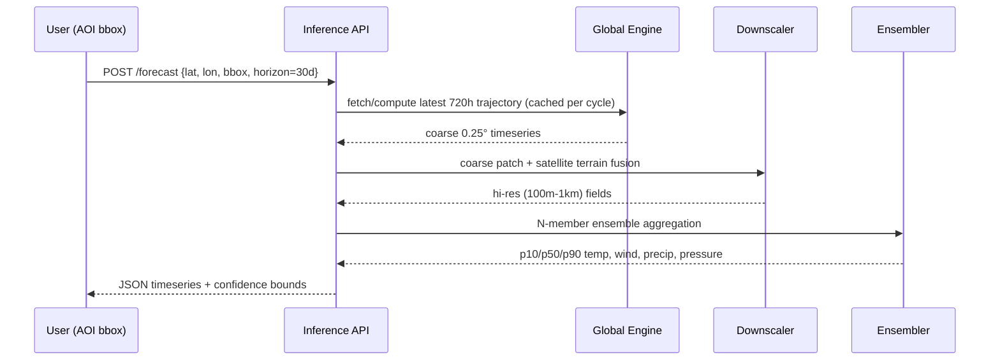

# Global 30-Day DDWF + Satellite AOI Downscaling System
## Technical Design Document (TDD) — v1.0

---

## 0. System Overview

```mermaid
flowchart LR
    A[ERA5/CMIP6/MERRA-2 Archive] --> B[Zarr Data Lake]
    B --> C[Global Planetary Engine\n(SFNO / GraphCast-style GNN)]
    C -->|0.25° coarse rollout, 6h steps x 120| D[30-Day Trajectory Cache]
    D --> E[AOI Downscaling Head\n(Diffusion Super-Res)]
    F[User AOI bbox/coord] --> G[Satellite Terrain Fusion\nDEM + LULC + LST]
    G --> E
    E --> H[Ensemble/Uncertainty Module]
    H --> I[p10/p50/p90 Timeseries API]
```

---

## Module 1 — Data Ingestion & Spatiotemporal Pipeline

**Storage format:** Zarr on object storage (S3/GCS), chunked as `(time=1, level=all, lat=180, lon=360)` per variable — chunk size tuned to ~10–50MB for parallel Dask reads. Use `zarr` + `xarray` + `kerchunk` to build virtual reference datasets over raw NetCDF4/HDF5 ERA5 archives without re-writing them wholesale (saves storage). CMIP6 ingested via `intake-esm` catalogs, regridded to a common 0.25° lat-lon (or HEALPix for SFNO) using `xesmf` conservative remapping.

**Static + dynamic feature stack (per grid cell, per timestep):**
```python
class GridFeatures(TypedDict):
    position_embed: Tensor  # [sin(lat), cos(lat), sin(lon), cos(lon), elev_norm] -> (5,)
    solar_zenith: Tensor    # computed via pvlib/astropy ephemeris, (1,)
    toa_insolation: Tensor  # (1,)
    soil_moisture: Tensor   # 4 layers, ERA5-Land, (4,)
    albedo: Tensor          # (1,)
    sst_anomaly: Tensor     # ERSSTv5 - climatology, (1,)
    oni_index: Tensor       # scalar broadcast, (1,)
    mjo_phase_amp: Tensor   # RMM1/RMM2, (2,)
```
Pipeline: Airflow/Dagster DAG → raw pull → QC (range/NaN checks) → regrid → normalize (per-variable z-score using 1991–2020 climatology) → write Zarr shard → register in a feature-store manifest (Delta Lake table) with time-partitioning for point-in-time correctness.

---

## Module 2 — Core Global Planetary Engine (Macro-Scale)

**Backbone choice: Spherical Fourier Neural Operator (SFNO)** over Swin-GNN, because SFNO enforces spectral consistency on the sphere natively (no pole distortion) and is cheaper per autoregressive step than message-passing GNNs at 0.25°.

```
Input: (B, C_in=86, H=721, W=1440)  # pressure-level + surface vars
  -> SphericalHarmonicTransform (real SHT, l_max=180)
  -> N=12 SFNO blocks:
       [SpectralConv(l_max) -> GroupNorm -> GELU -> SpatialConv(1x1) -> residual]
  -> Inverse SHT
  -> Output head: Conv1x1 -> (B, C_out=86, 721, 1440)
```

**Autoregressive rollout:** 6-hour hop, 120 recursive steps = 720h/30d. Trained with scheduled sampling (curriculum: 1-step → 4-step → 12-step rollouts) to reduce compounding error.

**Loss:**
```
L = λ1 * LatWeightedRMSE(pred, target)
  + λ2 * SpectralBandpassLoss(pred, target)   # penalizes energy loss at high wavenumbers
  + λ3 * PerceptualLoss(pred, target)         # pretrained CNN feature-space (adapted from LPIPS)
  + λ4 * PhysicsResidual(pred)                # hydrostatic balance + mass continuity penalty
```
`LatWeightedRMSE` weights each latitude row by `cos(lat)` to correct for grid-area distortion.

**Long-term conditioning:** GHG/CO2 anomaly scalar embedded via a small MLP and injected as a FiLM (feature-wise linear modulation) conditioning signal at each SFNO block, letting the same backbone represent different multi-decadal baselines.

---

## Module 3 — Satellite AOI & Terrain Downscaling Head (Micro-Scale)

**Architecture:** conditional diffusion super-resolution (DDPM/EDM-style), coarse (25km) → fine (100m–1km).

```
Conditioning stack (concatenated + cross-attended):
  - Coarse global forecast patch (upsampled bicubic as init)
  - DEM/SRTM (elevation, slope, aspect)
  - LULC one-hot embedding
  - LST from satellite AOI raster

U-Net denoiser:
  Encoder: [ResBlock -> SelfAttn (at 32x32, 16x16)] x4, downsample /2 each
  Bottleneck: ResBlock -> CrossAttn(coarse_forecast_tokens) -> ResBlock
  Decoder: mirrored, skip connections
  Timestep embed: sinusoidal -> MLP -> injected via FiLM in every ResBlock
```

**Zero-shot unmapped coordinates:** treat DEM/LULC as a continuous implicit function via a coordinate-based MLP (SIREN-style, sin activations) trained jointly, so any (lat, lon) not seen in training still yields a terrain embedding by querying the implicit field rather than a lookup table — enables inference on unmapped islands using only satellite-derived DEM (e.g., Copernicus GLO-30) with no site-specific retraining.

---

## Module 4 — Uncertainty Estimation & Ensembling

Two-tier ensemble:
1. **Initial-condition perturbation:** N=16 members via bred-vector or EDA-style perturbations fed through the SFNO engine.
2. **Model-form perturbation:** diffusion sampling noise at the downscaling head (different seeds) generates additional spread per IC member.

Aggregate to p10/p50/p90 via empirical quantiles across the N×M member ensemble. Spread is expected to grow with lead time — validate against CRPS and rank histograms; flag Day 15–30 outputs with explicit "low-skill" confidence bands rather than false precision.

---

## Module 5 — Infrastructure Under Compute Constraints

- **Base weights:** start from an open foundation model (Prithvi WxC or ClimaX) rather than training SFNO from scratch.
- **PEFT:** LoRA adapters (rank 8–16) injected into the spectral-conv and attention projection layers only; freeze base weights.
- **Memory:** BF16 mixed precision, gradient checkpointing every 2 blocks, FlashAttention-2 for the downscaling U-Net's attention layers, DeepSpeed ZeRO-3 with CPU offload for optimizer states if training on <8 GPUs.
- **Serving:** TensorRT-compiled inference graph for the SFNO backbone (static shape); diffusion head served with a distilled few-step sampler (DDIM, 8–16 steps) to keep AOI query latency reasonable.
- **Target:** ~2–4s per AOI query on a single A10/L4-class GPU at 16-step diffusion sampling; global 30-day rollout cached and refreshed once per forecast cycle (not per-query).

---

## Module 6 — End-to-End Integration Flow



**Stack summary:** PyTorch + PyTorch Lightning + Hydra for config; Zarr/xarray/Dask for data; FastAPI serving layer; Ray or Kubernetes Jobs for distributed training; MLflow for experiment tracking.

---

## Known Limitations to Flag to Stakeholders
- Skill beyond Day 10–15 is fundamentally bounded by atmospheric predictability limits (chaos theory) — no architecture eliminates this; the ensemble module manages it, doesn't solve it.
- Zero-shot unmapped-island inference is an extrapolation regime; validate against any available buoy/station data before trusting outputs operationally.
